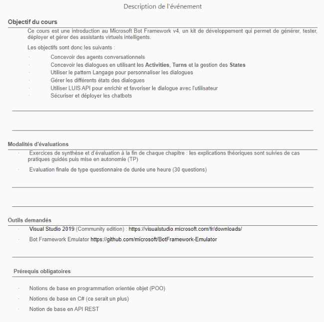

# Electif : Assistant virtuel

1. Créer un projet EchobOT 

2. Créer une classe bot GreetingBot hérite de activity handler 
3. Overider
    * OnMessageActivityAsync 
    * OnMemberAddedAsync 

   

4. Créer les Models 
    * Model UserProfile (avec name) 
5. Créer Services 
