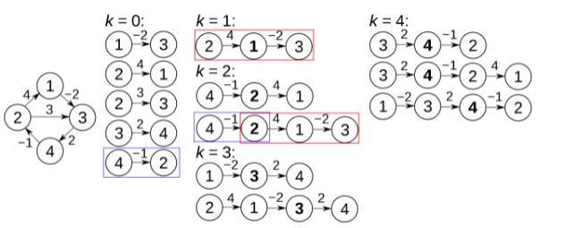
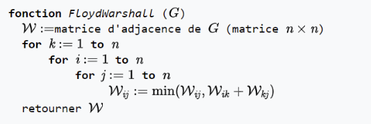

# Intelligence Artificielle 

## 08/09/202 
Cours sur les graphs orientés 

## 09/09/2021 

### Algorithme de Floyd-Warshall 

Appliquer l'algorithme de Floyd-Warshall sur le graph ( à copier ) 

|   | 1 | 2  | 3  | 4  | 5  |
|---|---|----|----|----|----|
| 1 | 6 | 3  | 1  | 7  | 10 |
| 2 | 3 | 6  | -2 | 4  | 7  |
| 3 | 5 | 8  | 6  | 12 | 15 |
| 4 | ∞ | ∞  | ∞  | ∞  | -3 |
| 5 | 7 | 10 | 2  | 10 | 3  |

### Algorithme de Dijkstra
