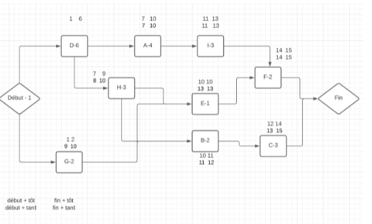

# Organisation et Management de Projet

## 07/09/2021 

### LES PRINCIPALES CAUSES D'ECHEC 

Solution écoute client :  
- Ecouter 
- Prendre des notes 
- Se taire 
- Questions ouvertes 
- Reformuler - Confirmer 

| Risque | Solution |
| ------------- | ------------- |
| Mauvaise définition du besoin Mauvaise analyse du marché | Poser des questions ouvertes Il faut laisser parler le client |
| Mauvaise communication (équipe, client)   | |
| Mauvaise estimation du prix de vente   | |
| Manque de compétence - disponibilité des ressources (humaines)   |Sécuriser le chemin critique |
| Demande irréalisable  ||
| Mauvaise analyse utilisateur  ||
| Deadline irréaliste  | Restreindre le besoin ,Savoir dire non (oui à la personne, mais non à la demande, argumentation, et proposition), Faire l'autruche  |
Mauvaise répartition des taches ||
| Management défaillant ||
| Gestion des Multi intervenants || 
| Non engagement des clients ou utilisateurs | Identifier l'importance du projet chez le client, et mettre en place une couverture pour aléas (temps et coûts, environ 15%) | 
 

### ETUDE DE FAISABILITE 

Faisabilité technique  : MOE 

Economiquement viable : MOA (estimation du ROI => Durée par rapport au cycle de vie du produit,  

cycle de vie du marché) 

- MOE : Maitrise d'œuvre -> Réalisateur du projet / Responsabilité 

 -> Assurance ( va couvrir la perte d'exploitation )  

- MOA : Maitrise d'ouvrage -> Emetteur du besoin 

 

### EXERCICE : Vous souhaitez remplacer votre logiciel A par un logiciel B plus performant. 

Cout du logiciel B : 150K € 

Le logiciel B doit rapporter 3000€/mois de plus que A 

Frais d'utilisation de B :  

Maintenance 600€/mois 

Electricité moins 100€/mois 

ROI = 150K / (3000 - 600+100) = 60 Mois => 5 ans 

### CAHIER DES CHARGES 
- Contexte  
- Objectif
- Périmètre  
- CDC Fonctionnel 
- CDC Technique 
- Spécifique 

### ORGANIGRAMME DES TACHES  

- Meilleure vision globale  
- Plus facile pour la répartition du travail  
- Gain de visibilité sur les parties traités 
- Meilleure communication  

Maslow :  
- sécurité +  
- appartenance + + +  

Client :  

- Sérieux 
- Implication  
- Rassurer le client sur la compréhension du CDC 

### PERT 

Les activités figurent sur les rectangles  
Les flèches ne représentent que les liens 
Les ronds représentent des jalons, Activités de durée nulle 

__Marge totale__ : Fin au plus tard - fin au plus tôt 

__Marge libre__ : marge que l'on a sans décaler la date de début au plus tôt de la tache suivante.  

 
Avantage de travailler au plus tôt 

- Meilleure gestion des aléas 

Inconvénient de travailler au plus tôt  

- Flexibilité 

## 03/11/2021 

### LES RISQUES  

- Risque humain 
- Risque économique 
- Risque logistique 
- Risque de mauvaise communication  
- Mauvaise gestion du temps 
- Risque partenaire et fournisseur :  
  * Retard 
  * Rupture  
  * Faillite 
  * Qualité 
- Risque client :  
  * Non-respect des engagements  
  * Arrêt du projet  
  * Evolution du besoin 
  * Bien cadrer le cahier des charges( Périmètre) Pour commandes supplémentaires 
  * Faillite 
  * Projet de moindre importance vu du client 
- Risque défaillance Matériel 
- Risque d'image de marque 
- Risque de Mauvaise conception  
- Risque de faisabilité technique 
- Risque lié à la taille du projet (nb personnes) 
- Risque de frein au changement (Client) 
- Anticiper/ Former/ Donner du sens 

### IDENTIFIER UN RISQUE, EVALUER LES RISQUES 

C : Criticité 
P : Probabilité 
G : Gravité  

C = P*G 
P et G entre 1 et 10 
C < 20 -> Risque mineur, accepté 
20 <= C <= 40 -> Risque sous surveillance, Anticiper, gérer les conséquences et prévoir l'action  
C >= 40 -> Risque majeur, Analyser la cause et mettre en place des actions préventives, Réévaluer le risque 
C' = P' * G' 

__ISHIKAWA ( 5M)__ 
TFE Thomas VE Mise en conformité ….. - ppt télécharger

 
