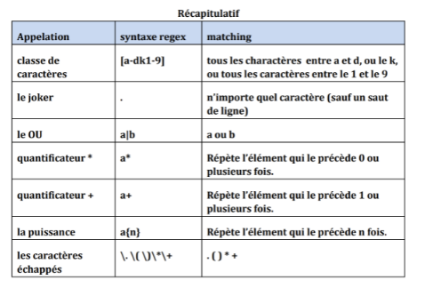

# Théorie des langages et compilation

## 07/09/2021 

### Expression Régulières (REGEX) 
 

### Langages et Grammaires 

 

#### Exercice 1  

𝐿1 = { 𝑎𝑛 , 𝑛 ≥ 0}  

a* 

Règles de production 𝑆 → 𝑎S | 𝜀  

𝐿2 = { 𝑎𝑛 , 𝑛 > 0}  

a+ 

Règle de production 𝑆 → 𝑎S | a 

𝐿3 = 𝑙𝑒𝑠 𝑚𝑜𝑡𝑠 𝑠𝑢𝑟 𝑎, 𝑏 𝑞𝑢𝑖 𝑐𝑜𝑚𝑝𝑜𝑟𝑡𝑒𝑛𝑡 𝑢𝑛 𝑠𝑒𝑢𝑙 𝑎 𝑎𝑢 𝑚𝑎𝑥𝑖𝑚𝑢𝑚 = {𝑤 ∈ 𝑎, 𝑏 ∗ , 𝑤 𝑎 < 2} 

b*a?b* 

Règle de production  

 𝑆 → bS | aA | 𝜀  

 A → bA | 𝜀  

S → BAB 

B → bB | 𝜀 

A → a | 𝜀  

𝐿4 = {𝑎 𝑛 𝑏 𝑚 , 𝑛, 𝑚 ≥ 0 } 

a*b* 

S  → AB 

B → bB | 𝜀 

A → aA | 𝜀 

𝐿5 = 𝑙𝑒𝑠 𝑚𝑜𝑡𝑠 𝑠𝑢𝑟 𝑎 𝑒𝑡 𝑏 𝑜ù 𝑏 𝑒𝑠𝑡 𝑖𝑚𝑚é𝑑𝑖𝑎𝑡𝑒𝑚𝑒𝑛𝑡 𝑠𝑢𝑖𝑣𝑖 𝑑 ′𝑢𝑛 a 

a*ba* 

S  → AB 

A → aA | B 

B → baA | 𝜀 

S → baS | aS | 𝜀 

𝐿6 = 𝑙𝑒𝑠 𝑚𝑜𝑡𝑠 𝑐𝑜𝑚𝑝𝑜𝑠é𝑠 𝑑𝑒 ∶  

- un a,suivi de 

- (une série non vide de b séparés par des c )ou un d, suivi de  

- une série (possiblement vide) de f  

 

a ( (bc)*b| d ) f* 

S  → aBF | adF 

B → bcB | b 

F → fF | c 

 

TODO : Finir l'exercice + Exercice 2 sur les Regex 

 

## 09/09/2021 

 

04/11 CC1 -> Regex, langages, gramm+aire (dérivation, arbre de dérivation, ambiguité 

### EXERCICE REGEX : 

1. Ecrire la regex des noms de variables (un mo composé d'une suite de chiffre, lettre ou "_", ne commençant pas par un chiffre) 

[a-zA-Z-][a-zA-Z-0-9]* 

2. Ecrire la regex des numéro de téléphone portable  

0[67][0-9]{8} 

3. Ecrire la regex des nombre entiers sans 0 inutile (10 mais pas 010)  

[1-9][0-9]* | 0 

4. Ecrire la regex des nombre décimaux sans 0 inutile (10.2 mais pas 010.2 ni 10.20, 2.0 ou 0.2 mais pas 2. ni .2)  

([1-9][0-9]*|)0\.(0|[0-9]*[1-9] 

5. Ecrire la regex des adresse email  

Cfc3696 -->  

6. Ecrire la regex des expressions additives d'entiers a. V1 : 12+6+3+44 mais aussi 12 b. V2 sans les expressions sans opérateur (sans le 12) 

 

### EXERCICE 2 GRAMMAIRE : 

 

L1 = { anbn, n>= 0} 

Pas de regex simple pour L1 

S -> aSb|𝜀 

 

L2  = {𝑃𝑎𝑙𝑖𝑛𝑑𝑟𝑜𝑚𝑒𝑠 𝑠𝑢𝑟 ∑ = 𝑎, 𝑏 } 

S -> aSa | bSb | a | b | aa | bb 

 

((b*a){3})*b* 

 

S -> BaBaBaBaS | B 

B -> bB| 𝜀 

 

S -> aSBc 

S -> aSBc -> a2SBaBc  -> a2 SBBcc 

cB -> Bc 

SB -> b 

bB -> b 

 

 

 

### Grammaires engendrés  

S aSbb I c 

### Exercice 5 :  

C -> 0 | 1 | … |9 (Seul cas où l'on peut mettre des ….)

N -> nombre ? 
+ 
- 

012 / 0 

1+ 

(12) 

(1+2)(3+4) 

 

-1 + 2 

1+2+3 

(-(-2)) 

(1+2)*3 

 

(-1 + 2 ) 

 
### Grammaire : 

 

C -> 0 | 1 | … |9 

N -> CN | C 

O -> + | - | / | * 

P -> ( | ) 

 

S -> SOS | (S) | N |(-N)  

 

### Exercice 6  

 

+ 

- 

void toto (int toto) 

void toto (char [] a) 

void toto (char [] a []) 

private Etudiant toto (char int) 

 

 

P -> private |public | protected | 𝜀  

 

S -> static | 𝜀 

R -> Int | String | Char | Boolean |Float  | void 

T -> [] |𝜀 

V -> CL 

 

S ->  PSRTT(RTTV) | 𝜀 

 

Parametres -> Type var | Param, Type var  

Var -> Var L | Min | _ 

TypeR ->Type | void 

Type -> TypePrim | Cslasse |  Type [] 

Classe -> Classe L | Maj 

Quality ->static | e 

TypePrim -> Int | Float | String| Boolean 

 

- langage - regex - grammaire (dérivation, arbre de dérivation, ambiguïté) 

 

### PREPARATION DS 

#### REGEX 

"(0|(\\+33)|(0033))[1-9][0-9]{8}",  

Numéro de téléphone exemple 

 

04/11/2021 

 

#### REVISION Grammaire 

 

L = a*b( (ac)+ | b) 

aabac 

Aabb 

Bacac 

 

Vt = {a, b, c} 

Vn = AB 

 

S ->  AB 

A -> aA | b 

B -> ac | acB | b 

 

Ou 

 

S -> AbC 

A -> aA | rien 

C -> D | b 

D-> acD | ac 

 

#### Dérivation  

 

S -> AbC 

S -> aAbC 

S -> aabC 

S -> aabb 

 

#### Exercice : analyse par décalage-réduction 

 

S -> S+S | S*S | N  

N -> NC | C 

C-> 1 | 2 | 3 | 4 

 

W = 12 + 3 * 4  

Pile 

Entrée 

Actions 

$ 

12 + 3 * 4 $ 

Décalage 

1 

2 + 3 * 4 $ 

Réduire C-> 1 

C 

 2 + 3 * 4 $ 

Décalage  

C2 

 + 3 * 4 $ 

Réduire C -> 2 

CC 

 + 3 * 4 $ 

Réduire C - > N 

CN  

 + 3 * 4 $ 

Réduire N -> CN 

N  

 + 3 * 4 $ 

Réduire S -> N 

S 

  + 3 * 4 $ 

Décalage + 

S + 

3 * 4 $ 

Décalage 3 

S + 3   

  * 4 $ 

Réduction C -> 3 

S + C  

* 4 $ 

Réduction N-> C 

S + N  

* 4 $ 

Réduction S -> N 

S + S  

* 4 $ 

Réduction S -> S + S 

S 

*4 $ 

Décalage * 

S *  

4 $ 

Décalage 4 

S * 4 

$ 

Réduction C -> 4 

S * C 

$ 

Réduction N -> C 

S * N  

$ 

Réduction S -> N 

S* S 

$ 

Réduction S -> S*S 

S 

$ 

 
 ## 02/12/2021 

E -> E + E  | E *E | N  

Pile 

Entrée  

Action 

N + N * N 

décalage 

N  

+ N * N 

Red E -> N 

p(0)   p(1) 

E 

+ N * N 

décalage 

E + N  

   *  N 

Red E ->N 

E + E    

   * N 

Red E -> E + E  

 

 
